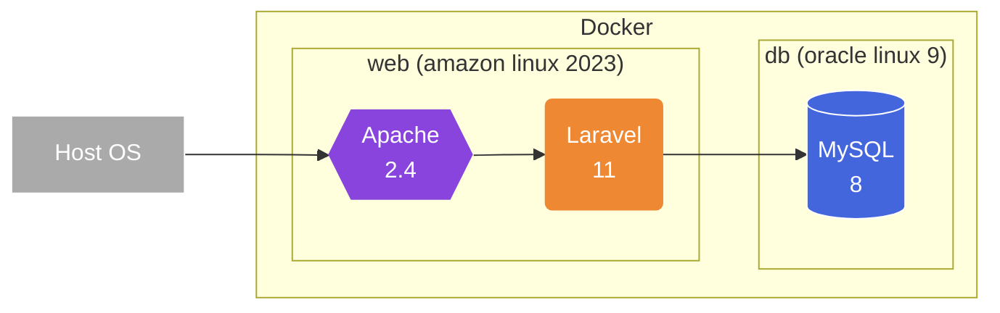

# laravel-docker
Docker files for Laravel

# Architecture

```mermaid
flowchart LR

%%外部要素
OU1[Host OS]

%%グループとサービス
subgraph GS[Docker]
  subgraph GV["web (amazon linux 2023)"]
    NW1{{"Apache<br>2.4"}}
    CP1("Laravel<br>11")
  end
  subgraph GV2["db (oracle linux 9)"]
    DB1[("MySQL<br>8")]
  end
end

%%サービス同士の関係
OU1 --> NW1
NW1 --> CP1
CP1 --> DB1

%%サービスのスタイル
classDef SOU fill:#aaa,color:#fff,stroke:#fff
classDef SNW fill:#84d,color:#fff,stroke:none
classDef SCP fill:#e83,color:#fff,stroke:none
classDef SDB fill:#46d,color:#fff,stroke:#fff

class OU1 SOU
class NW1 SNW
class CP1 SCP
class DB1 SDB
```
